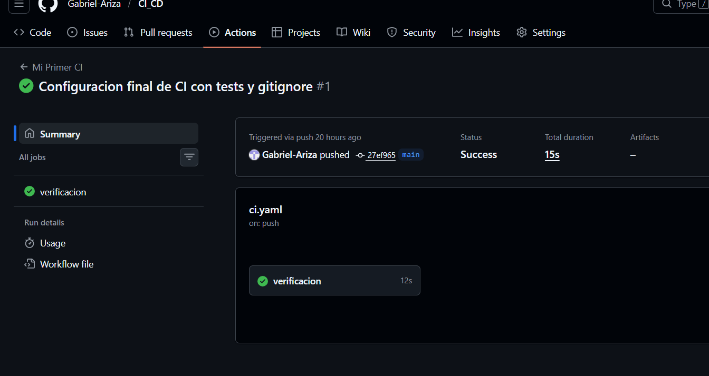
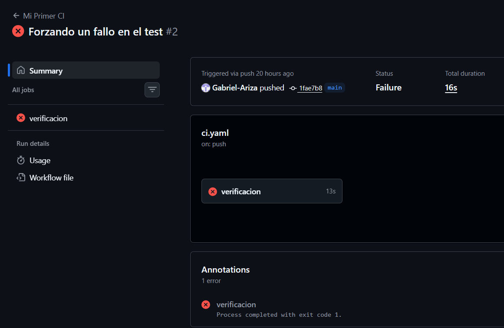
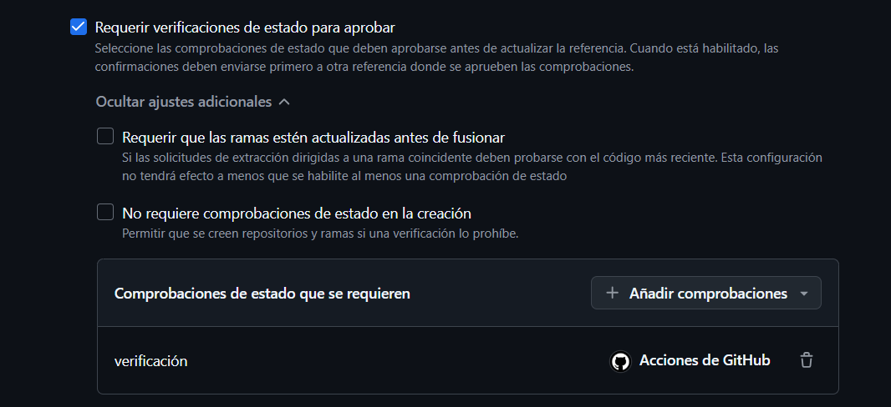

# Taller Práctico: Integración Continua (CI/CD – Automatización)

Este proyecto documenta el aprendizaje y configuración de un flujo de **CI/CD** utilizando **GitHub Actions**. El objetivo es garantizar que cada cambio en el código sea validado automáticamente antes de ser integrado.

## 1. Conceptos Fundamentales

- **CI (Integración Continua):** Práctica de integrar cambios de código de forma frecuente, activando procesos automáticos de construcción y prueba.
- **CD (Entrega/Despliegue Continuo):** Automatización del envío del código validado a entornos de prueba o producción.
- **Pipeline:** El flujo de trabajo automatizado (definido en el archivo `ci.yml`).
- **Runner:** El servidor (en este caso de GitHub) que ejecuta los pasos del pipeline.

---

## 2. Configuración del Pipeline (CI)

El archivo de configuración se encuentra en `.github/workflows/verificacion.yaml`.

### Estructura del Workflow:

- **Disparador (Trigger):** Se activa en cada `push` a cualquier rama.
- **Entorno:** Utiliza la máquina virtual con `ubuntu-latest`.
- **Job 1 - Calidad y Análisis (calidad-y-analisis):**
    1. Checkout del código.
    2. Instalación de dependencias (`npm install`).
    3. Verificación de formato con Prettier (`npm run format:check`).
    4. Ejecución de tests unitarios con Jest (`npm test`).
    5. Análisis de calidad con SonarCloud.
- **Job 2 - Despliegue (despliegue):**
    - Solo se ejecuta si el Job 1 pasa correctamente.
    - Despliega automáticamente a GitHub Pages.

---

## 3. Evidencias del Taller

### Ejecución del Pipeline (Estado Verde)

Aquí se muestra el pipeline funcionando correctamente tras validar los tests unitarios.

> **[]**

### Error Intencional (Estado Rojo)

Para validar la efectividad del CI, se modificó un test para forzar un error. El sistema detuvo la integración correctamente.

> **[]**

---

## 4. Buenas Prácticas Aplicadas

Para este proyecto se configuraron reglas de protección de rama en GitHub para asegurar la calidad del software:

1.  **Ejecutar pruebas en cada push:** Automatizado mediante GitHub Actions.
2.  **Protección de Rama (Main):** Se bloqueó el merge si el pipeline está en rojo.

### Configuración de Reglas de Protección

_Ruta: Settings > Branches > Add branch protection rule_

> **[]**

---

## 5. Preguntas de Reflexión

### ¿Qué ocurre si un equipo no usa CI?

Se produce el "Infierno de la Integración". Los errores se descubren días o semanas después de haber sido escritos, lo que hace que encontrarlos y repararlos sea mucho más costoso y lento. La rama principal suele ser inestable y el despliegue a producción se vuelve un evento de alto riesgo.

### ¿Por qué es importante automatizar pruebas?

La automatización elimina el error humano y la fatiga. Un desarrollador puede olvidar correr un test manualmente, pero un pipeline de CI no lo olvidará nunca. Esto garantiza que el software mantenga su funcionalidad básica (regresión) cada vez que se añade algo nuevo.

### ¿Cómo se relaciona CI con calidad de software?

La CI es el primer filtro de calidad. Actúa como una red de seguridad que garantiza que solo el código que cumple con los estándares mínimos (estilo, sintaxis, pruebas funcionales) pueda avanzar en el ciclo de vida del desarrollo. Mejora la confianza del equipo en el código base.

### ¿Qué ventajas ofrece CD en producción?

Permite reducir el "Time-to-Market" (tiempo de salida al mercado). Al automatizar el despliegue, las empresas pueden entregar valor a los usuarios de forma constante (varias veces al día) con un riesgo mínimo, permitiendo correcciones rápidas y una retroalimentación constante del cliente.

---

**Curso:** Fundamentos de Herramientas de Ingeniería de Software
**Ingeniero:** [Tu Nombre]
**Fecha:** 2026
